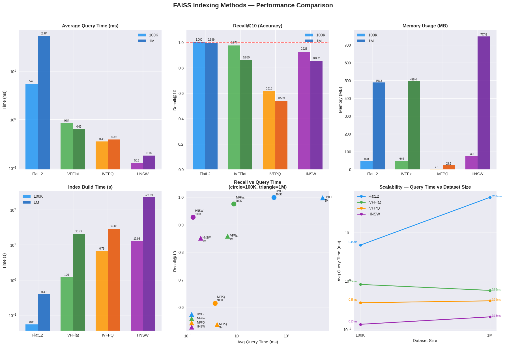

# 🔍 FAISS Indexing for Large-Scale Vector Search

> A comprehensive benchmarking study of four FAISS indexing methods on the SIFT1M dataset (1 million 128-dimensional vectors), comparing speed, accuracy, and memory efficiency.


---

## 📌 Project Overview

Modern AI applications like recommendation systems, semantic search, and image retrieval need to search through **millions of vectors in milliseconds**. This project explores how different **FAISS (Facebook AI Similarity Search)** indexing strategies handle this challenge at scale.

We implement and benchmark **4 FAISS indexes** on the industry-standard SIFT1M dataset across two sizes — **100K and 1M vectors** — measuring:
- ⚡ Query speed
- 🎯 Recall accuracy (Recall@10)
- 💾 Memory usage
- 🏗️ Build time
- 📈 Scalability

---

## 📊 Key Results

| Index | Query Time (1M) | Recall@10 | Memory (1M) | Speedup vs FlatL2 |
|-------|:--------------:|:---------:|:-----------:|:-----------------:|
| **FlatL2** | 52.84 ms | 0.9991 | 488.28 MB | 1.0x (baseline) |
| **IVFFlat** | 0.63 ms | 0.8596 | 496.41 MB | 83.4x ⚡ |
| **IVFPQ** | 0.39 ms | 0.5386 | 23.51 MB | 137.0x ⚡ |
| **HNSW** | **0.18 ms** | 0.8523 | 747.80 MB | **293.7x** 🚀 |

### 🏆 Winners
- **Fastest queries** → HNSW (293.7x faster than exact search)
- **Least memory** → IVFPQ (20.8x less memory than exact search)
- **Best balance** → IVFFlat (83.4x faster, strong recall)
- **Perfect accuracy** → FlatL2 (exact baseline)

---

## 📈 Performance Visualizations



*Six-panel comparison: query time, recall accuracy, memory usage, build time, recall vs speed tradeoff, and scalability across dataset sizes.*

---

## 🗂️ Dataset

**SIFT1M** — Scale-Invariant Feature Transform benchmark dataset

| Property | Value |
|----------|-------|
| Source | [ann-benchmarks.com](https://ann-benchmarks.com) |
| Format | HDF5 |
| Base vectors | 1,000,000 |
| Query vectors | 10,000 |
| Dimensions | 128 |
| Data type | float32 |
| Size | ~500 MB |

---

## 🧠 FAISS Indexes Explained

### 1. IndexFlatL2 — Exact Search Baseline
Compares every query against **every single vector** in the database using L2 (Euclidean) distance. Guarantees perfect recall but is the slowest — query time grows linearly with data size.

### 2. IndexIVFFlat — Inverted File Index
Divides vectors into **clusters** using k-means. At search time, only the most relevant clusters are checked (controlled by `nprobe`), dramatically reducing search time with minimal accuracy loss.

> Parameters used: `nlist=100` (100K), `nlist=1000` (1M), `nprobe=10`

### 3. IndexIVFPQ — IVF + Product Quantization
Extends IVFFlat by **compressing** each vector using Product Quantization. Splits 128-dim vectors into 16 sub-vectors encoded with 8-bit codes — reducing memory by 32x at the cost of some accuracy.

> Parameters used: `m=16`, `bits=8`, `nlist=100/1000`, `nprobe=10`

### 4. IndexHNSW — Graph-Based Index
Builds a **multi-layer proximity graph** connecting each vector to its nearest neighbors. Search navigates the graph greedily — like following directions to get closer and closer to the target. Delivers the lowest query latency with strong recall.

> Parameters used: `M=32`

---

## ⚙️ Experimental Setup

```
Platform:     Google Colab (CPU)
Language:     Python 3.10+
Libraries:    faiss-cpu, numpy, pandas, matplotlib, seaborn, h5py
Dataset sizes: 100,000 and 1,000,000 vectors
Queries:      1,000 query vectors (k=10)
Metric:       Recall@10, Avg Query Time, Std Dev, Memory (MB), Build Time (s)
```

---

## 🚀 How to Run

### 1. Open in Google Colab
Click the notebook file and open with Google Colab, or:

```
https://colab.research.google.com/
```

### 2. Install Dependencies
```python
!pip install faiss-cpu
```

### 3. Download Dataset
```python
!wget https://ann-benchmarks.com/sift-128-euclidean.hdf5
```

### 4. Run All Cells
Run cells top to bottom. The notebook will:
- Load and prepare the dataset
- Build all 4 FAISS indexes
- Run 1,000 search queries per index
- Calculate all metrics
- Generate comparison graphs

---

## 📁 Repository Structure

```
faiss-vector-search-benchmarking/
│
├── faiss_notebook.ipynb      # Main Colab notebook with all code
├── faiss_results.csv         # Raw experimental results
├── faiss_comparison.png      # Performance comparison graphs
├── FAISS_Report.docx         # Full IEEE-format report
└── README.md                 # This file
```

---

## 📉 Scalability Analysis

As dataset grows **10x** (100K → 1M):

| Index | Query Time Growth | Scales Well? |
|-------|:-----------------:|:------------:|
| FlatL2 | 9.7x slower | ❌ Linear |
| IVFFlat | Slightly faster | ✅ Sub-linear |
| IVFPQ | Nearly same | ✅ Excellent |
| HNSW | 1.4x slower | ✅ Very good |

FlatL2 is the only index that fails to scale — all approximate indexes handle growing data significantly better.

---

## 💡 When to Use Which Index?

| Use Case | Recommended Index |
|----------|:-----------------:|
| Small dataset, need perfect accuracy | FlatL2 |
| Real-time search, AI assistants | HNSW |
| Memory-constrained systems | IVFPQ |
| General large-scale production | IVFFlat |
| Billion-scale with GPU | IVFPQ + GPU |

---

## 📚 References

1. Johnson, J., Douze, M., & Jégou, H. (2019). *Billion-scale similarity search with GPUs*. IEEE Transactions on Big Data.
2. Malkov, Y. A., & Yashunin, D. A. (2018). *Efficient and robust approximate nearest neighbor search using HNSW*. IEEE TPAMI.
3. Jégou, H., Douze, M., & Schmid, C. (2011). *Product quantization for nearest neighbor search*. IEEE TPAMI.
4. [ANN Benchmarks](https://ann-benchmarks.com) — Approximate Nearest Neighbor Benchmarks.
5. [FAISS Documentation](https://faiss.ai) — Facebook AI Similarity Search.

---

## 👤 Author

**[Nusrat Afifa Dina]**
CSE488: Big Data Analytics

---

⭐ *If you found this project useful, consider giving it a star!*
